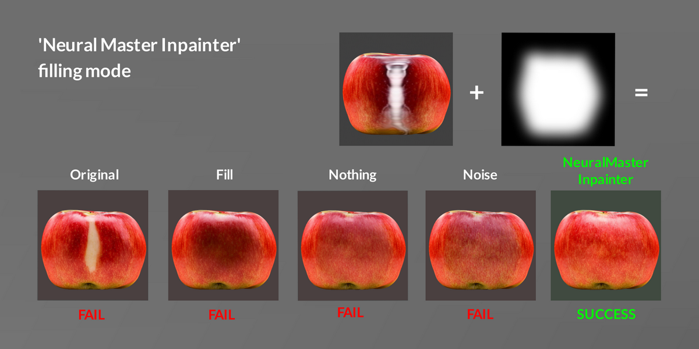

# FAQ

### 0.9.04 - improving a quality and speed of inpainting

1. Added a second mode for automatically creating masks, based only on the current camera position and normal direction. The old mode has been renamed to “Balanced”.

2. The “Balanced” automatic generation algorithm has been improved (fewer manual operations are now required).

3. Added support for [Neural Master Inpainter extension for Automatic1111](https://github.com/neuralmaster/neuralmaster_inpainter.git) to improve inpainting quality.

