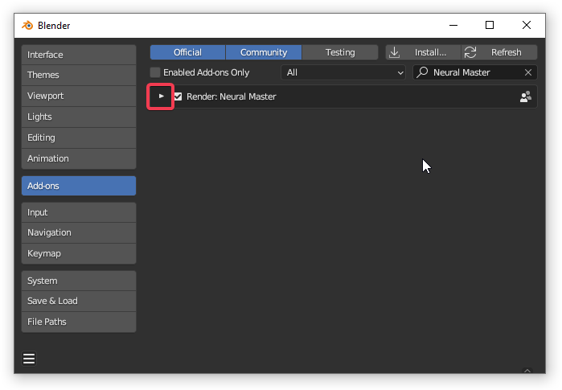
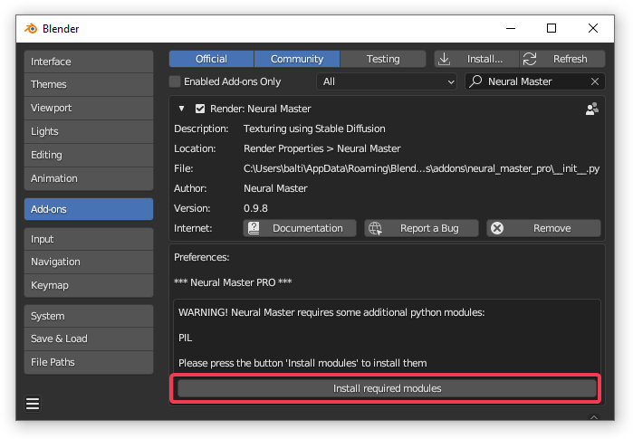
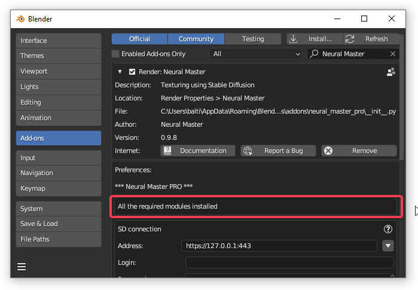
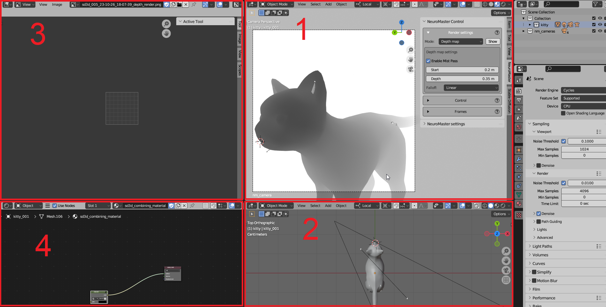
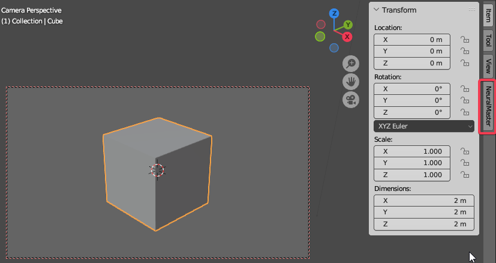
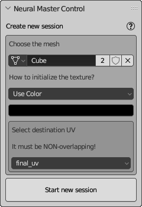
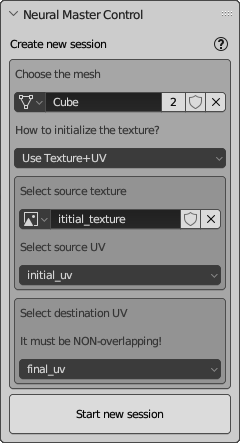

# Get started

## Download and install

### Download

NeuralMaster addon is avaliable on two stores:
  
- [Blendermarket](https://blendermarket.com/products/neuralmaster)
- [Gumroad](https://nmaster.gumroad.com/l/neuralmaster)

After buying you will download addon as zip file.
Do not unpack it but only place it on some folder as you convenient. 

The process of installation is mainly typical excluding installing additional components.

### Install addon 

Tthe process is the same of installation any addon for Blender. 

1. Open preference window by selecting menu item Edit -> Preferences.
2. Open addons list by selecting the item 'Add-ons' in the left part of window.
3. Press 'Install' button in the top right corner of window.
4. Select zip file downloaded above using standard dialog window.
5. Enable the addon by checking the checkbox near its title.

### Install additional components 

This stage is not typical. 

NeuralMaster required some Python libraries that are not installed in Blender by default.  
The addons page contains a special button to install these components.

1. Expand addons setting by pressing the "triangle" button near the title as you can see bellow  
   
2. If some components not found you will see the list of these components and the button "Install required modules". Press the button  
   
3. Restart Blender and open NeuralMaster addon page again to understand that all the modules installed:  
   

If you have problems of installation please follow [the instruction](cant_install_pil.md)  

## Create 3d model and UV

Addon Neural Master is intended for texturing but not for UV-mapping and modeling.  
So you need to have a 3d model and UV map to texture it.  

Also, you can have some rough initially texture before starting Neural Master because in some cases it can improve the consistency of the final texture or decrease the quantity of iterations.  

### Notes

1. At the moment Neural Master supports only NONE overlapped UV map

2. The 3d model can be not fully complete - small details of mesh can be detailed during texturing if they do not influence the project UV in any point of view.   

## Intialize Neural Master session

1. Select the menuitem Neural Master -> Create workspace  
   As the result you will see the following window  
     
   The workspace described in [UI basics](ui_basics.md)  
   The menuitem Neural Master will disappear from menu after creation workspace. 

2. Open Neural Master Panel  
   
   * Move the mouse cursor in the area 1 of workspace (see the picture above) and then press N button to display panels  
   * Then select "NeuralMaster" tab on the right side of the area as you can see on the picture bellow  
   

3. Fill initial properties and then create the session
   
   There are two main settings:

   * mesh name  
   * final UV name (that will use for baking the final texture)

   Also, you can select the initial texture if you have it. This texture can use another UV and you need to select it. 
   If you don't have any texture, then select some initial color and all the model initially will fill by this color.
   By default, the black color is selected, and usually it is enough.
   
   Bellow are two possible variants of the initial settings.       
   
          

   Note:

   * You must have the only instance of the textured mesh in the scene.
   * All the modifiers of this object must be disabled. 
   * All the other object in the scene must be hidden, and their render must be disabled. 
   * You need to create UV before texturing, and it must be NON overlapping.

## Start Stable Diffusion

Neural Master use Automatic1111 WebUI for Stable Diffusion to generate 2d images.
You can launch it on local or remote host.

Please follow the instruction on the [official site of Automatic 1111 WebUI]((https://github.com/AUTOMATIC1111/stable-diffusion-webui?tab=readme-ov-file)) to deploy and launch it.

Note:
1. If you use external paid hosting for Stable Diffusion please don't forget to stop it when you finish or suspend the job.
2. Before starting Stable Diffusion we recommend you to learn about main principles of Neural Master and Common Pipeline so as not to waste hosting time reading this instruction later.       

## Texture the model using NeuralMaster 

There are multiple possible pipelines for texturing 3d models using Neural Master.
At the beginning we recommend to use [our suggestions](common_pipeline.md)
