# How to install Stable Diffusion

If you are new in Stable Difusion (SD), I recommend you to **use remote SD** server, but not local.  
**It is a cheap and simple way to start**.

If you use my recommendation bellow you will spend about 10$ at least for 2 weeks of close working with powerful server (for example A4500 20-24 VRAM) that costs several thousand of dollars.  
Also, you will spend a few time to deploy SD not fighting against a lot of problem of local installation.  

## Deploy SD on remote server

Neural Master uses Automatic1111 Web UI interface for access to Stable Diffusion (as is the most part of other solutions based on SD).

I can recommend you 2 services:

- [**Runpod**](#deploy-sd-using-runpod). If you use SD about ~4 hours every day or less, then, it seems, Runpod is better for you, because it has cheap price plan 'Community Server' and per minute billing.

- [**Paperspace**](#deploy-sd-using-paperspace). If you use SD ~6-8 hours or more every day, then Paperspace can be better, because it contains a good monthly subscription.   

I would recommend you to start with Runpod and then maybe go to Paperspace.

### Deploy SD using RunPod 

RunPod is one of the best and cheapest ways to launch remote Stable Diffusion server for personal using because it contains cheap price plan 'Community Server' and per minute billing.   

If you want to support Neural Master, please use this [Runpod link](https://runpod.io?ref=uro6febx) to access it.

The instructions below may seem complicated at first glance, but believe me, it is much simpler than local installation)

Please follow my instructions, and it will take you half an hour just to run SD for the first time.

Next time you will spend a couple of minutes.

#### Runpod Instruction

1. Register account on [Runpod](https://runpod.io?ref=uro6febx).

2. Add money to you account, the minimal amount is 10$.

3. Create and deploy a new server (named Pod in RunPod)

    - Open pods page and press '+ GPU Pod'

    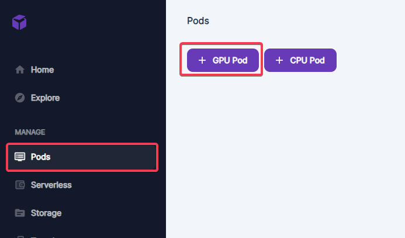
   
    - Select the required properties of new pod:
   
        - '**Fast Stable Diffusion**' template  
        - '**Community Cloud**' cloud type  
        - '**Extreme**' internet speed
    
    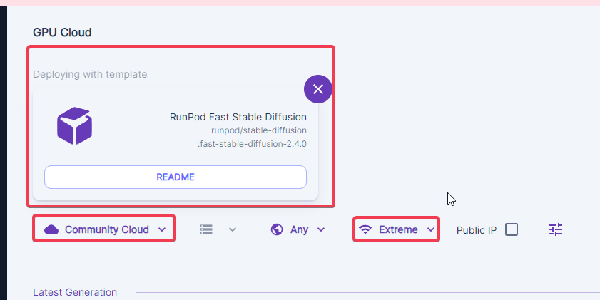
        
    - Select the required server.   
      I would recommend you 'A4500 20 GB VRAM, 29 GB RAM, 8 vCPU', 0.21$ per hour, because it is cheap and powerful. But be sure to try different ones.
   
    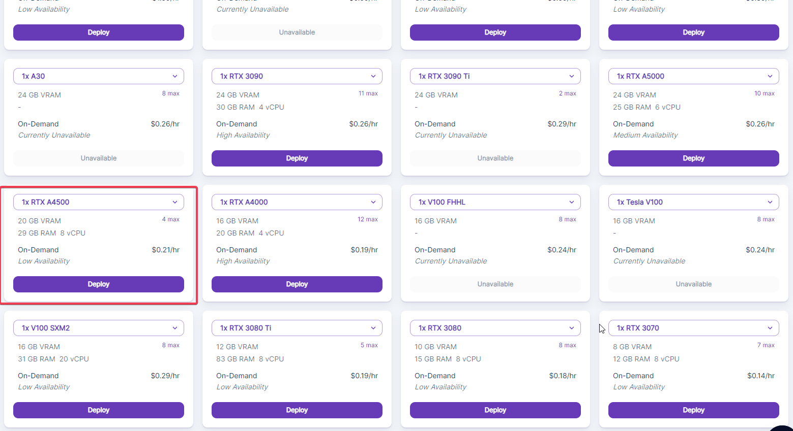

    - In the next window confirm the selection
   
    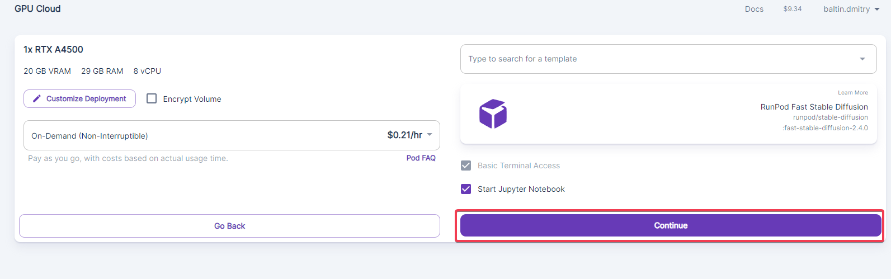

    - Confirm again here, and wait a minute while the server is deploying. 

    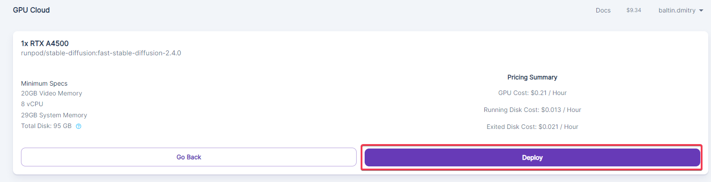

4. Connect to the server.

    - Press 'Connect' button 

    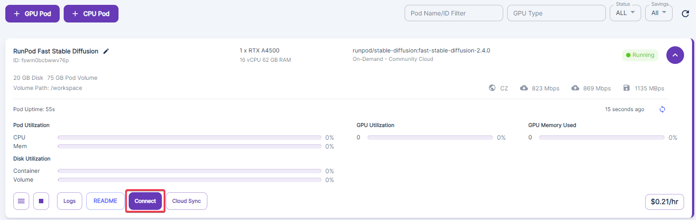

    - Press 'Connect to Jupyter' button 

    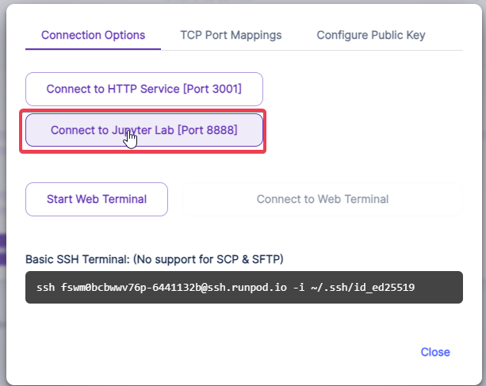

    Now the environment for your server is created, and you can configure the settings of Stable Diffusion.

5. Configure the parameters of SD and launch it.

    - Double click 'RNPD-A1111.ipynb' to open configuration notebook 

    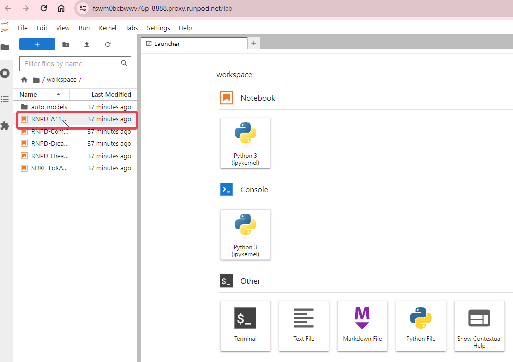

    - Scroll the opened notebook to the section 'Model Download/Load' and modify the string:    
      _Original_Model_Version = "v1.5"_  
      (SD version 1.5 is usually better for texturing that the default one SDXL)
    
    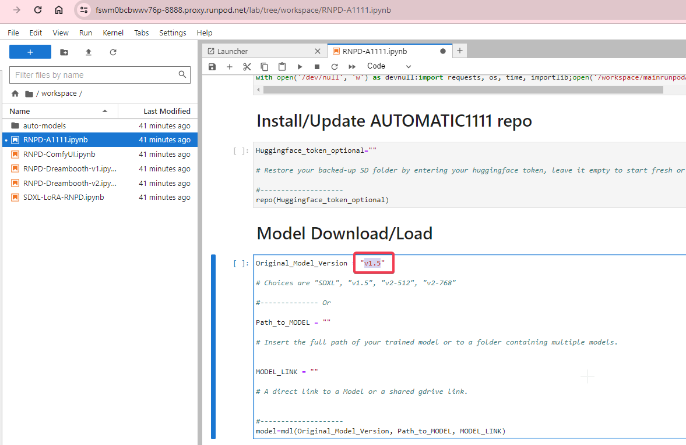
    
    - Scroll the notebook to the section 'ControlNet' and add a couple of strings (ControlNets 'Depth' and 'Normals'):    
      _CNet("2", ControlNet_XL_Model)  
      CNet("5", ControlNet_XL_Model)_

    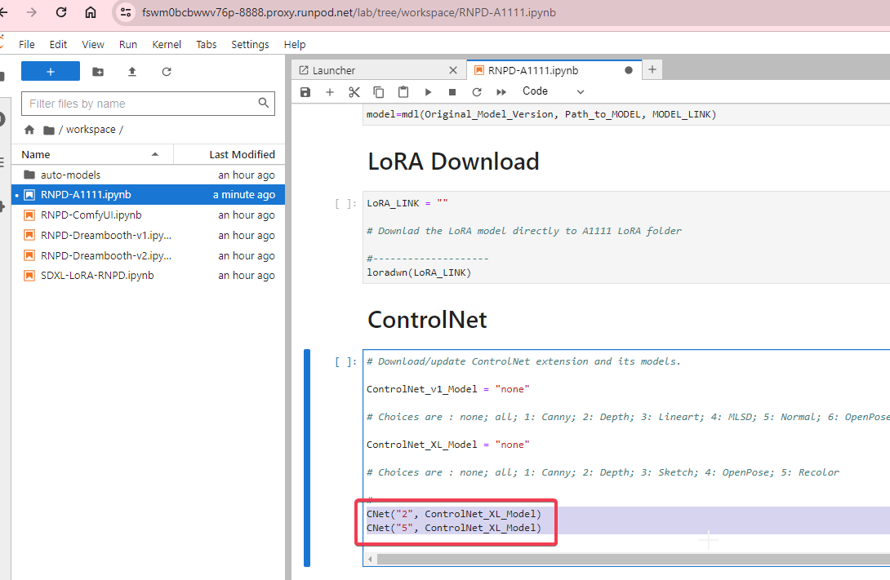

    - Press double-triangle button 'Restart Kernal and Run All Cells...' in the top panel, confirm selection and wait 1-3 minutes:  
   
    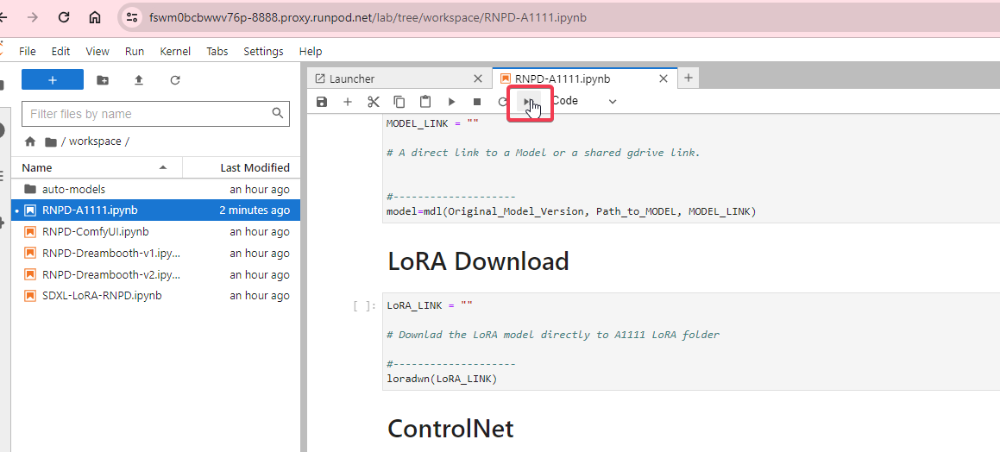

    - Open Stable Diffusion Web UI by clicking to the link in the bottom of the notebook:  

    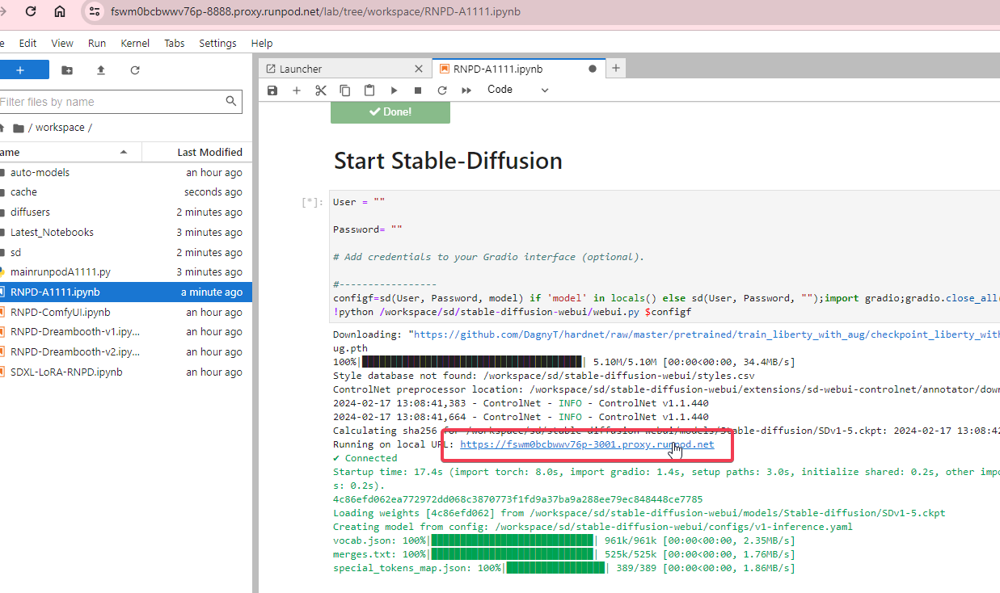

    - Make sure the page opens:  

    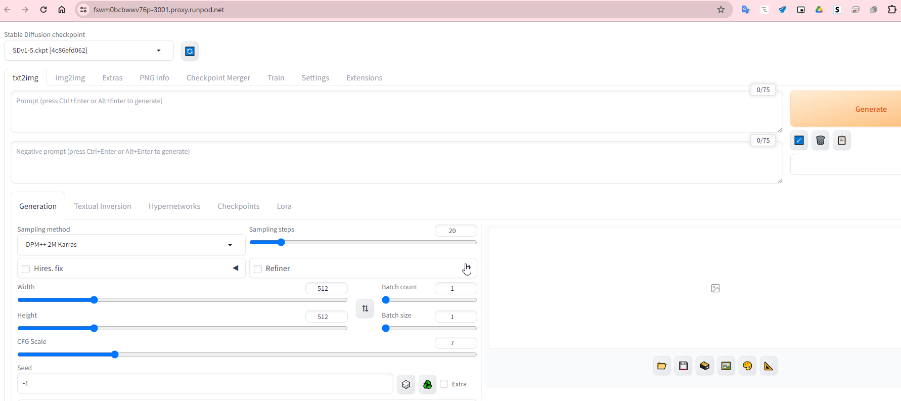

6. Install additional components.

    Unfortunately Fast Stable Diffusion Template (used above) does not contain two components important for Neural Master:

    - **IP adapter** ControlNet
   
    - **Neural Master Inpainter** Extension 

    Let's install them.

    - Create a new empty Notebook 

    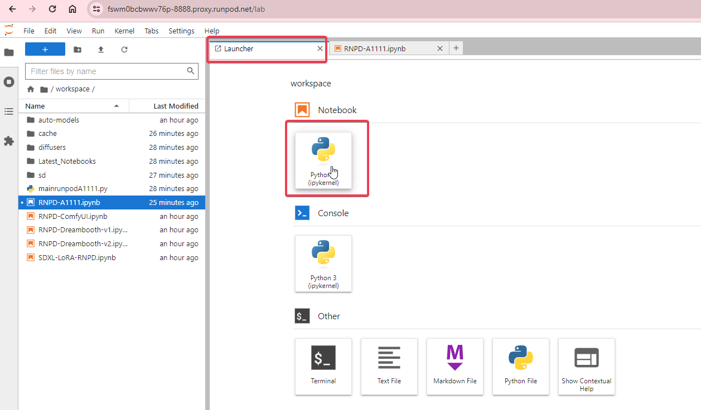

    - Open [this script from this site](py/sd_deploy.py), select all and copy it to clipboard 

    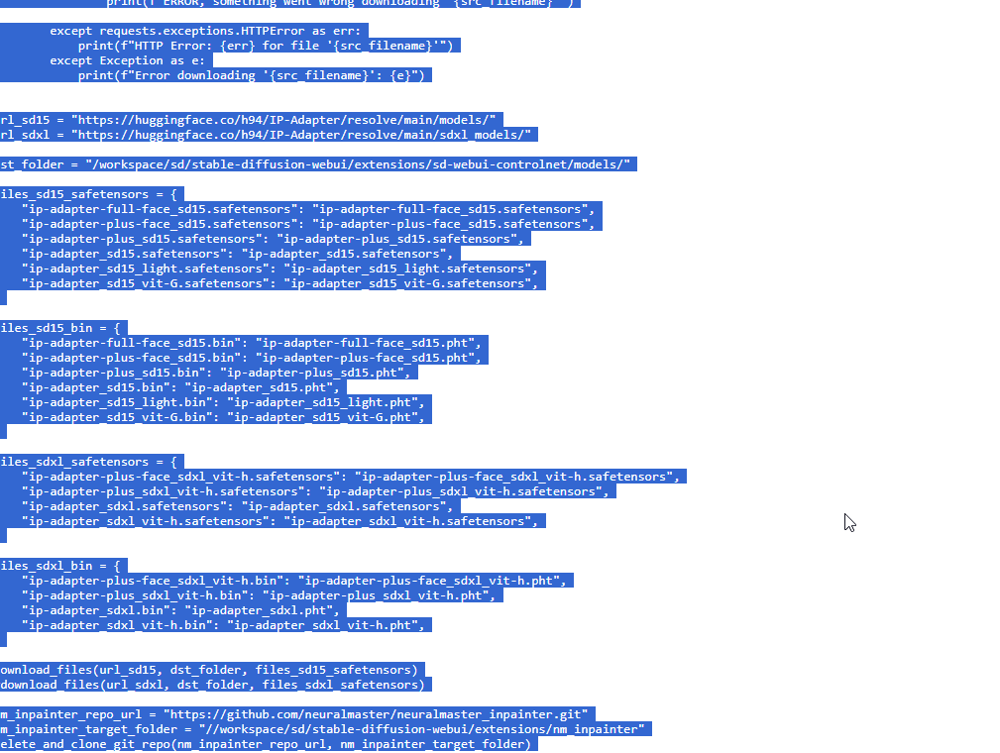

    - Paste selection to the empty notebook created above and launch it

    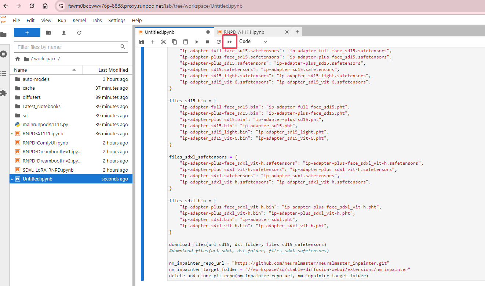

    - Switch back to the main notebook 'RNPD-A1111.ipynb' and restart it
   
    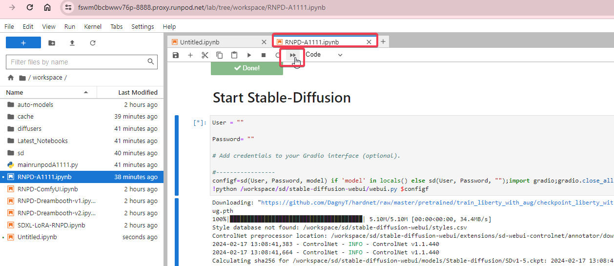

    - Make sure the page opens:  

    

    - Copy url of this page and use it in Neural Master 

That is all.

#### Note

**Don't forget to stop server after finishing working or when you have a long pause because RunPod has per minute billing.**

### Deploy SD using Paperspace

Documentation is under development

## Local installation

There are a lot of instructions about how to install local SD.    
I recommend you to use the original instructions from the developer of Automatic1111 Web UI and ControlNet that is listed bellow.

1. Install Stable Diffusion Automatic1111 Web UI using the [original instruction from the developer of Automatic1111 Web UI](https://github.com/AUTOMATIC1111/stable-diffusion-webui?tab=readme-ov-file#installation-and-running)

2. Install additional components:

    - Install **ControlNet** extension and common models '**control_v11p_sd15_normalbae**' and '**control_v11f1p_sd15_depth**'. [Installation instructions from the developer of ControlNet](https://github.com/Mikubill/sd-webui-controlnet#installation)    

    - Install **IP adapters** ControlNets models. Use the same [Installation instructions](https://github.com/Mikubill/sd-webui-controlnet#installation), 
       and download models from the following addresses:  

        - **ip-adapter-plus**: [https://huggingface.co/h94/IP-Adapter/resolve/main/models/ip-adapter-plus_sd15.safetensors](https://huggingface.co/h94/IP-Adapter/resolve/main/models/ip-adapter-plus_sd15.safetensors) 
        - **ip-adapter**: [https://huggingface.co/h94/IP-Adapter/resolve/main/models/ip-adapter_sd15.safetensors](https://huggingface.co/h94/IP-Adapter/resolve/main/models/ip-adapter_sd15.safetensors) 
        - **ip-adapter-plus-face**: [https://huggingface.co/h94/IP-Adapter/resolve/main/models/ip-adapter-plus-face_sd15.safetensors](https://huggingface.co/h94/IP-Adapter/resolve/main/models/ip-adapter-plus-face_sd15.safetensors) 

    - Install **Neural Master Inpainter** extension. 

        - Click to the tab 'Extensions' in the top menu of Automatic 1111 Web UI.
        - Click to the tab "Install from URL".
        - Enter the URL of the extension: https://github.com/neuralmaster/neuralmaster_inpainter.git
        - Click 'Install' button.
        - Click 'Apply and Restart UI'.

### Notes

1. If you would like to use SDXL then the ControlMet models must be others, but I recommend to start with SD15. 

## What configuration of Stable Diffusion is required?

Here is a small explanation of SD configuration created above.

Some Stable Diffusion components are indeed required, and some are optional.

### Required SD components

1. Use SD 1.5 model or a model derived from it (for example, Deliberate, Photon or another). This version better than SDXL because SDXL does not supports Normal Map ControlNet models that is very important.
2. Depth ControlNet (exists for SD1.5 and SDXL) is required to the texture fits accurately on the model.
3. Normal map ControlNet (exists for SD1.5 only) is also required so texture fits accurately on the model, in combination with the depth map ControlNet. 
4. A set of IP adapters (exists for SD1.5 and SDXL) but primarily IP Adapter Plus are requred to use reference image.

If you are using a Fast Stable Diffusion environment, which I recommend above, all of these details (an even more other ControlNet models) are already in the environment, except for IP Adapters.
You can use the following [Python script to download and deploy IP adapters](py/sd_deploy.py).
Please fix the destination folder in the script before running it.

### Optional SD components

1. SDXL model. Use it if you need high resolution, that is usually the most important for the first texture layer. 
SDXL don't support Normal Maps and so the texture will not fit so accurately on the model as SD15 can, but in many cases it's enough to use Depth map and Canny Edge ControlNet giving the Fresnel map to the preprocessor.    
2. Canny Edge ControlNet (exists for SD1.5 and SDXL) is often required to fix macro details when inpainting micro details. Also, it can be used to texture fits accurately on the model if you use SDXL but not SD 1.5 (In this case use Fresnel map as an input of Canny preprocessor).
3. ControlNet reference_only. This can also be used to add a reference image, but the IP Adapter Plus typically yields better results.
4. Scribble Controlnet (exists for SD1.5 and SDXL) often can be used to add some details of texture as patterns for these details.
5. LoRA models. This is a perfect way to keep generation consistent, but creating LoRA requires additional work.
If you plan to use neural art regularly (which in my opinion is absolutely necessary today), you should study LoRA technology and create and use your own LoRA models.
6. Inpainting SD models (for example, a [model from Runway](https://huggingface.co/runwayml/stable-diffusion-inpainting/resolve/main/sd-v1-5-inpainting.ckpt)).
This often results in a really smooth and high-quality blend of textures, but usually the image is blurred and lacks interesting detail.
7. Custom SD models. Typically, neural artists use such models, rather than the original SD 1.5 or SDXL, because custom models, which are based on the original models, 
but created later and created by neural artists that use it and contain knowledge crucial for practical tasks.
However, I don't have specific information yet about how effective these models are for texturing, so I can recommend none of them as a required.
I hope that soon there will be new models more focused on texturing. 