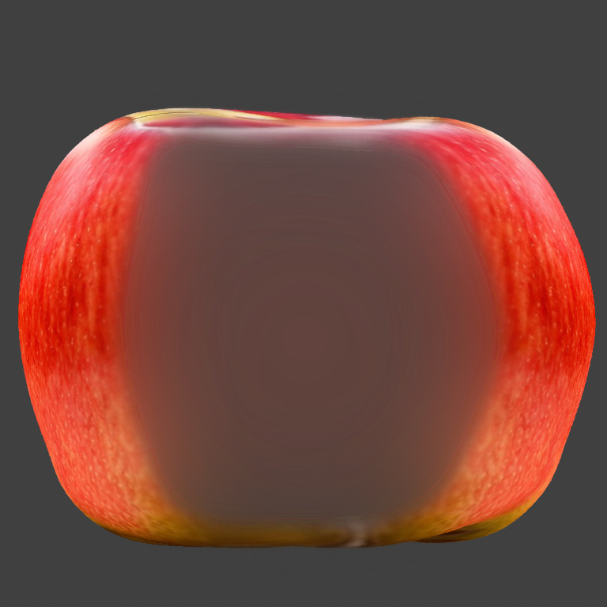
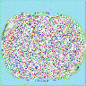
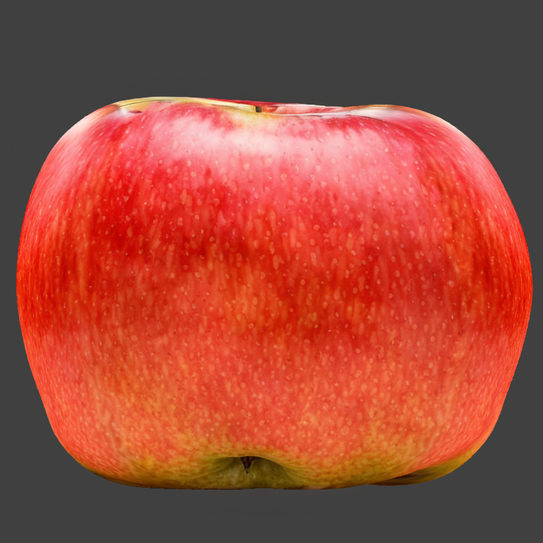

# Neural Master extension for Automatic111 Web UI

Расширение является препроцессором и выполняется перед основным циклом SD.
Расширенеи совместимо со всеми моделями, эбедингами, моделями контролнет и прочими дополнениями к SD, поскольку не касается их внутренней структуры, а только подготоваливает маски для работы SD.  

Расширение наиболее эффективно в сочетании с дополнением NeuralMaster для блендера, которое создает автоматически корректную маску для его работы. 

## Устанока расширения

Используется стандартная процедура установки расширений для Automatic 1111

## Использование

1. Выберите тип inpainting fill = 'NeuralMaster' 
2. Используйте двухканальную маску инпаинта, формат которой опасан ниже. 

**Примечания**  
При помощи редактора картинок в веб интерфейсе Automatic 1111 подобную двухканальную маску создать невозможно, однако, ее можно загрузить в режиме Inpaint upload.
При использовании Blender addon Neural Master, маска создается автоматически. 

## Проблематика

При исопльзовании режима инпаинтинга на вход SD в подается изображение предварительно подгтовленное, в соотвествии с заданной маской инпаинта и параметром Inpainting Fill.
То етсь, Inpainting Fill - работает как препроцессор перед работой SD.

В интерфейсей Automatic1111 WebUI доступно 4 варианта Inpainting Fill:  
- Fill  
- Original  
- Nothing  
- Noise  

Рассмотрим применение каждого режима на конкретном примере дорисовки текстуры яблока c помощью дополнения Blender NeuralMaster.

### Исхолдные данные

Будем использовать модель SD 1.5, sampler DPM++ 2M Keras, а также маски Controlnet Normal, Depth (для точного совествия текстуры и 3д-модели) и IP Adapter для задания референсного изображения.
В качесве референсного изображения будем использовать некоторую картинку с яблоком, однаковую во всех случаях.

Исходная 3д модель выглядит так:

Сначаал создаем текстуру текстура для модели яблока форнтальной камерой в режиме txt2img при помощи референсной картинки, а также дефолтных параметров адона (ControlNet Depth + Normal + IP adapter).  
Получаем изображение:    

Поворачиваем камеру на 90 градусов и видим следующее:

На боковой поверхности текстура очень сильно растянута, а в центральной части и вовсе абсолютно неверный белый цвет. 

Будем пробоваить дорисовать эту текстуру в режиме инпаинта двумяразными вариантами маски.

Бинарная маска:
  

Сглаженаня маска:  

(Маски сгененированы автоматичеки в NeuralMaster Blender Addon с настрйоками по умолчанию).

### Режим Original 

Режим **Original**не иодицифирует изображение перед подачей его на вход SD.

То есть, на вход SD подается все то же изображение:

Латентное представление которой выглядит так:

 (Сглаженная маска)

 (Бинарная маска)

В результате инпаинта получаем:

При использовании бинарной маски:

При использовании сглаженной маски:
 

Этот режим отлично подходит, если изображение, которое надо дорисовать, уже примерно похоже на желаемый результат, и его необходимо улучшить.
В нашем примере получаем фейл, поскольку SD пытается встроить в картинку широкую белую послосу посередине.   

### Режим Fill 

Режим **Fill** заполянет изображение в области инпаинта некоторым средним цветом картинки (исключая облатсь инпаинта) и подает его на вход SD.  
Таким образом, на выходе препроцессора Fill получаем изображение: 

При использовании бинарной маски:

При использовании сглаженной маски:

Латентное представление которого выглядит так:
 (Бинарная маска)
 (Cглаженная маска)  

В результате генерации получаем изображение:

При использовании бинарной маски:  

При использовании сглаженной маски:

У изображения появляется темный серый оттенок, потому что средний цвет картинки учитывает и темно-серый цвет фона, а не только цвет полезного объекта - яблока.  

В результате, изображение после инпаинта также неудовлетварительно.

### Режим Nothing

В этом режиме латентное прсдтавление изображения, в латентном представлении, заливается нейтральным цветом, что выглядит так:

 - бинарная маска  
 - сглаженная маска

В результате генерации получаем изображения тоже не удовлетворительного качества  

При использовании бинарной маски:  

При использовании сглаженной маски:

### Режим Noise

Препроцессор **Noise** заоплняет изображение в латентном представлении некоторым рандомным шумом, что выглядит так:

 - бинарная маска  
 - сглаженная маска

Обычно, это дает нечто совершенно ужасное, однако, в данном случае, благодаря IP Adapter, результат не так уж и плох, но тоже не удовлетворительный.

При использовании бинарной маски:  

При использовании сглаженной маски:

### Вывод эксперимента

Наилучший результат позволяют достичь режимы Original (обеспечивающий маскимально качественынй стык) и Fill (который учитывает контекст), но они имеют недостатки:  

1. Fill при заливке использует ненужный цвет фона, а не только цвет полезного объекта.

2. Original учитывает некорретный исходный цвет картинки в области инпаинта.

## Режим Neural Master

Новый режим инпаинта NeuralMaster призван исправить перечисленыне недостатки, заполняя облатсь инпаинта изображением, зависящим от контекста, но более продвинуто:

1. Для заполнения использовано не все пространство картинки, а только полезная ее часть, заданная дополнительной маской.
2. После созданяи маски на основе контекста, она обединяется с исходной картинкой при помощи градиентной маски.

### Формат входной маски инпаинта

Для работы расширения использована двухканальная выходная маска.

1. Канал 0 (красный) содержит маску инпаинта, задаующую область закраски. Эта маска подобдна классической маске инпаинта, однако она не просто бинарная, а градиентная, что неоходимо для работы второй фичи.

2. Канал 1 (зеленый) содержит маску полезного ихображения, средним значенем которого будет заполнено изображение в области инпаинта, что ползволяет игнорировать цвет фона. 

### Пример работы режима

Рассмотрим работу режима на том же примере - текстурирование яблока.

Входная маска выглядит так.

Здесь маски соединены в одно ихобраэение, как написано выше. Вот как выглдядят ее отдельные каналы:

Канал 0 (red) - маска инпаинта (совпадает со сглаженной маской, использованной выше):  

Канал 1 (green) маска полезного объекта:  

Внешняя маска выделяет только полезный объект, в данном случае - яблоко.

Здесь обе маски сгенерированы автоматически при помощи аддона Neural Master для блендера, но он могут быт также созданы и при помощи другх инструментов. 

При помощи этих масок и входного ихображения, получается слудющее ихзображение, которое подается на вход SD:

Как виджно, на перефирии маски инпаинта, в оласти ее градиента, изображение совпадает с исходным, а центре оно заполнено красным цветом, усредненным цветом яблока. 

Латентное представление этого изображения: 

Результат инпаинта:

Как видим, этот результат получился наиболее качественным.
Причем, такой результат стабильно воспроизводится при использовании различных значений Seed.

**Примечания** 

1. Если  красный и зеленый канал входной маски совпадают, используется режим Original, о чем выводится сотвествующее предупреждение в консоль.
2. Теоретически, расширение может дать некоторый эффект даже без исопльзованяи второго канала, только за счет градиентной маски. Однако, этот вариант в настоящий момент не использован.

