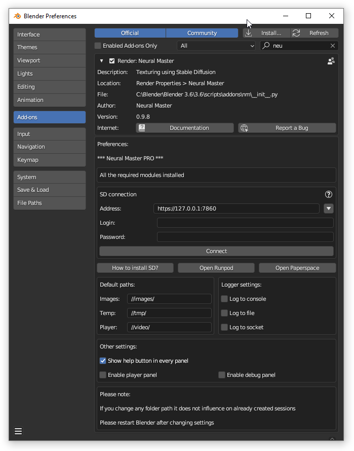

# Neural Master Addon Preferences

## Accessing the Preferences

To configure the 'Neural Master' addon settings, follow these steps:

1. Open Blender and go to the 'Edit' menu.
2. Select 'Preferences' from the dropdown menu to open the Blender Preferences window.
3. In the Preferences window, click on the 'Add-ons' tab.
4. Locate 'Neural Master' in the addons list. You can use the search bar to find it quickly by typing 'Neural Master'.
5. Once you find the addon, click on it to reveal its preferences.
6. Click the triangle icon next to the addon's name if it's not already expanded to view all settings related to 'Neural Master'.

Here, you can adjust the settings as detailed in the sections above.

## Additional Modules Installation Status

Top panel indicates the installation status of required additional Python modules and the list of them.
In the example above all the necessary modules are installed.  
See the details in the instructions about [installing the addon](../get_started.md).  

## Default Paths

NeuralMaster creates multiple files that will be stored in the directories specified here.

- **Images**: Path for image files of texture layers. Default is `//images/`.  
- **Temp**: Directory for temporary files that are inputs and outputs of Stable Diffusion.  
Default is `//tmp/`.  
- **Player**: Location for output files of the player. Default is `//video/`.  

## Logger Settings

Neural Master utilizes the standard Python 'logging' library to log its events and supports three types of destinations: console, file, and network socket.  
You can configure your logging preferences here.

- **Log to console**: Enable to have logs output to the Blender console.
- **Log to file**: Check this to log events to a file.
- **Log file name**. Default is `//mm_log.txt`.
- **Log to socket**: Enable logging over a network socket.
- **Log IP Address**: Default is `127.0.0.1`.
- **Log Port**: Default is `19996`.

## Other Settings

- **Show help button in every panel**: Toggle to display a help button in every addons panels.
- **Enable player panel**: Enable or disable the player panel feature.

By default, player panel is disable to avoid accidental data loss because player deletes and recreates UV maps so it can be destructive.

## Important Notices

- Changing folder paths in the preferences will not affect sessions that have already been created.
- Please restart Blender after modifying any settings to ensure changes take effect.
