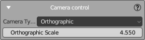
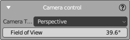

## Camera Control Panel

The Camera Control panel allows you to adjust the camera settings in your scene, providing the ability to switch between different camera types and to modify parameters that affect the camera's view.

Depending on the selected camera type, you will have different settings available:

### Orthographic Camera

When "Orthographic" is selected in the Camera Type dropdown, the following option is available:

- **Orthographic Scale**: This determines the size of the orthographic view. A larger number will show more of the scene, while a smaller number will show less. Adjust this value to control the scale of the orthographic projection.

### Perspective Camera

When "Perspective" is chosen, you will see a different setting:

- **Field of View**: This angle determines how wide the camera's view is. A larger field of view will capture a wider area of the scene, creating a more pronounced perspective effect. A smaller field of view will capture a narrower area, which can be useful for focusing on specific details or for mimicking the effect of a telephoto lens.

### How to Use the Camera Control Panel

1. To switch between camera types:
   - Open the Camera Control panel.
   - Click on the "Camera Type" dropdown menu.
   - Select either "Orthographic" or "Perspective" to switch modes.

2. To adjust the Orthographic Scale:
   - Ensure the camera type is set to "Orthographic."
   - Use the slider or input field to set the desired scale. This affects how much of the scene is visible in the camera's view.

3. To change the Field of View:
   - Make sure the camera type is set to "Perspective."
   - Use the slider or input field to adjust the field of view. This controls the angle of the camera's perspective.

Adjust these settings as needed to frame your scene correctly according to the artistic requirements of your project.

For more information on camera settings and their visual impact, consult the Blender manual or other educational resources on camera composition in 3D environments.
