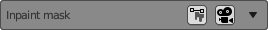
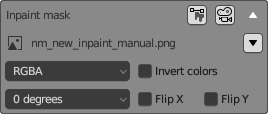
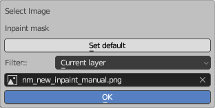

# Image settings

This interface element is used for selecting images, including Inpainting masks and Controlnet unit input images. 
It features a triangle-shaped button in the top right corner for collapsing and expanding the element.

## Collapsed state

When collapsed it displays:

* Image type
* Button "Open in editor" - opens the image in a 2D editor on the left side of the workspace.
* Button "Apply in camera" - apply the image as the background image of the main camera of Neural Master (named nm_camera).
## Expanded state

In the expanded state, you can select an image and specify options for converting it before using it in Stable Diffusion.

* **Image name** describes the role of the image in the layer, for example Input Image
* ***Selection button** - to the right of the name, a button with icon of a triangle. When you click it, "Image selector" window described below appears.
* **Channels to use**. There are 6 options to choose from:   
"RGBA" (all channels including Alpha),  
"RGB" (All channels excluding Alpha),  
"R" (Red channel only),  
"G" *Green channel only),  
"B" (Blue channel only),  
"A" (Alpha only)  
This selector allows you to use one file as the input of multiple Stable Diffusion channels, using different channels.  
The default settings is RGBA.   
* **Invert colors**
* **Angle** of rotation. There are 4 options to choose from: 0, 90, 180, 270 degrees
* Flip X - flip the image horizontally
* Flip Y - flip the image vertically

**Notes**  
1. All these settings do not change the image, but it will be transformed before use, using them.  
2. When you apply the image as background of the camera then not all the options listed above are applied (because Blender does not support all of them):  
- Rotation and flips are applied.  
- Invert colors and select channels are nod applied.  
Regardless, all settings will be applied when the image is used as input to Stable Diffusion.

## Image selector window

Allows you to select an image from a list of available images in the current blend file.
  
* **The "Set Default" button** sets the default image for this element, the role of which is predefined. For example, the default name for the input image in "img2img" mode is the rendered diffuse image "nm_new_diffuse_render.png".
* **Filter** dropdown contains a list of filters for more convenient image selection.
* **Image** dropdown lists all images that match the filter you selected above. Use it to select the desired image.