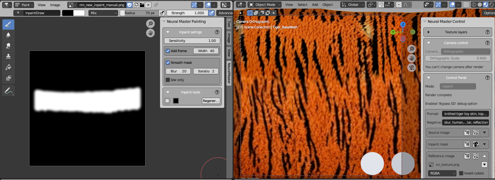
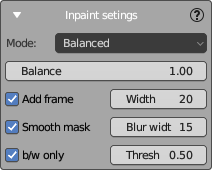

# Inpaint Settings Panel

This panel is displayed in the Image Editor area and contains settings for inpainting.

At the moment the panel contains only settings of the automatic inpainting mask.

## Automatic inpainting mask

**NeuroMaster** is capable to autocreate an inpainting mask based on 'Normals Angle' map, which is generated during the creation of each texture layer.

The example of such automatic impaint mask is shown on the image bellow.

During inpainting, it's usually necessary to redraw the areas that were significantly stretched and distorted in the creation of previous frames, but not inpainting areas that will be stretched in the position of the current camera.

**Autogenerate mask** uses 'Normals Angle' masks to create such an inpainting mask.

'Normals Angle' is a simple 1-channels mask that is an inverted dot between normals and camera view vector (it is not the same that 3-channels Normal Map, that used by Neural master as an input for ControlNet).
Mask looks similar Fresnel mask, but they have mode smoothed borders that is important for the used task. 
The mask is also baked when creation a new Fusion layer as a combination of all the source layers.
That's why at every moment it's possible to understand the value of stretching of every pixel of the texture.  

There are two **Autogenerate mask** modes available.

- **Balanced** mode find the boundary of inpainting mask as the line where the 'Normals Angle' values of the current texture layer and previous layers equal.
This boundary can be shifted by using the **Balance** parameter, which by default is set to 1.
Increasing this parameter will expand the inpainting area, while decreasing it will reduce the area.  

- (NEW) **Current camera only** mode uses the 'Normals Angle' map of the current texture layer only.  
The parameter **Threshold** is used to determine the maximum value of the 'Normals Angle' map, which will be inside the inpainting mask.
Increasing this parameter will expand the inpainting area, while decreasing it will reduce the area.

Also, some additional features are used:  

- Add a frame on the perimeter of the image. In some cases it also can improve the inpainting quality because SD uses more information for inpainting.
- Smooth the border of inpainting mask, that is required to improve the inpainting quality, especially in the case of using the **Neural Master Inpainter**.
- Convert the mask to black and white only.

All of these features can be disabled. 

Automask is generated automatically when creation of new shot layer and also can be launched manually from [Inpaint Tools panel](inpaint_tools_panel.md).    
In the both cases is used the settings from this panel.

## Settings

### Mode

- **Balance (1.00 default)** is used for **Balanced** mode only and adjusts the balance for the inpainting mask's boundary that is described above.
Increase this value to expand the inpainting area, or decrease it to reduce the area.

- **THreshold (0.25 default)**: is used for **Current camera only** mode and give teh threshold valued of 'Normals Angle' mask of the current texture layer that is described above.
Increase this value to expand the inpainting area, or decrease it to reduce the area.

### Add Frame

- **Add Frame**: When checked, this option adds a border around the image to potentially enhance the quality of inpainting.
- **Width**: This numerical field determines the width of the frame in pixels.

### Smooth Mask

- **Smooth Mask**: Activating this option smoothens the borders of the inpainting mask.
- **Blur Width**: Defines the width of the blur applied to smooth the mask edges.

### Black & White Only

- **B/W only**: This checkbox, when ticked, ensures that the inpainting mask is generated in black and white only, as opposed to grayscale.
- **Threshol (0.50 default)**: This field sets the threshold level for the black and white mask. Values closer to 1.00 result in more white areas, whereas values closer to 0.00 result in more black areas.

### Notes

1. If the both options **Smooth** and **Black & White Only** are enabled, then the mask is first smoothed and then converted to black and white.
2. If a frame and smoothing are used at the same time, then the width of the frame must be at least larger than the width of the smoothing in order for it to be visible in the picture.