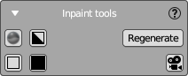

# Inpaint Tools Panel

This panel contains tools for inpainting and displayed in the Image Editor area.

Panel contains 6 buttons in 2 rows.

Top row:

- (NEW) Smooth the image
- (NEW) Convert the image to black and white
- **Autogenerate** inpainting mask using the options from the Inpaint Settings panel.  
This feature is described in the [Inpaint Settings](inpaint_settings_panel.md) section.

Bottom row:

- Select **white brush color**
- Select **black brush color**
- Show/Hide the opened image as background image of main camera 

