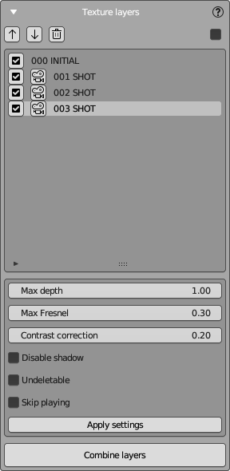
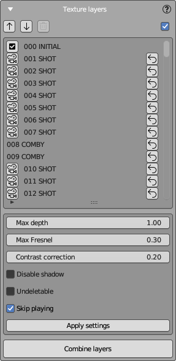

# Texture Layers Panel

The Texture Layers Panel in NeuralMaster is where you manage and adjust individual texture layers of your 3D model.

The panel has two areas and a set of buttons:  
- **Layers list** - in the top side of the panel.  
- **Layer properties** - in the bottom side.  

## Layer List

Here is a list of your texture layers.

Each layer has a unique numerical identifier displayed in the panel. The initial layer always has the number '000', and each subsequent layer increments by one: 001, 002, 003, etc.  
Also every layer has a type that is also displayed near ID. 

NeuralMaster supports **3 types of layers**:  
- **Initial Layer**: The base texture layer created in the [Create Session Panel](create_session_panel.md).  
- **Shot Layers**: Generated using Stable Diffusion, controlled by the [Main Control Panel](main_control_panel.md).  
- **Fusion Layers**: Combinations of other layers, created using "Combine layers" button described bellow. 

The layers list supports two display modes, shown below:  
- **Only Active Layers**: Displays only active layers that can be applied to the model now. (Left image)  
- **All Layers**: Displays all layers, including deleted (archived) ones. (Right image)  

To switch between these modes, use the checkbox at the top right corner of the panel.

## Operations with Layers

This panel allows you to execute various operations with layers.

### Applying a Layer to the Model

Controlled by checkboxes to the left of the layer. 
Enabling the checkbox applies the texture layer to the diffuse shader, and disabling it removes the layer from the shader.
You will see the result immediately in 3D view areas. All checked layers are applied to the model simultaneously, added in the order listed. 
If a checkbox is absent, the layer is deleted (but can be restored that you can see below).

### Sorting Layers

Reorder layers using the arrow buttons above the layers list.  
The changes will be reflected immediately in both 3D view areas of the workspace.

### Deleting a Layer

Sometimes it's necessary to delete texture layers.  
Deleting a layer removes its UV Map, marking it as "archived".
Other objects (images, camera, settings) remain in the Blender file, and the layer is usually restorable.

To delete a layer, select it and press the **Trash** button at the top.  
Note that shots are automatically deleted when creating a Fusion layer.

### Restoring a Deleted Layer

A deleted layer can be restored by pressing the **rounded arrow** button on right.
Restoration reactivates all layer entities; only the UV map is recreated from scratch,
assuming the camera has not been modified, and the mesh remains unchanged, allowing for an accurate reconstruction.

### Displaying the Camera of a Shot Layer

Press the button with the **camera icon** in the layer's line to display the layer's camera.  
The layer's camera, stored in the blend scene after being applied, will be set as active in the main view area.
It's hidden, and its translation is locked, so please do not modify it.

### Combining Layers

Press the **Combine layers** button at the bottom of the panel to create a new **Fusion Layer** from the checked layers by using Blender's "Bake" operator.  
This layer will have the only diffuse texture using **Destination UV Map** (that was used during session creation).  
When creating a Fusion layer, all source **Shot Layers** are deleted automatically, except those marked as **undeletable**.

## Layer Properties

The Layer Properties area shows various properties of the selected layer. Most of them are shader properties, but some are other types.

**Shader Properties**: These are non-destructive and can be modified at any point from the creation of the shot layer onwards.

- **Max Depth**: Controls the maximum depth for the depth map. It can be used to omit parts of the texture that are too far from the camera, such as when texturing a head to avoid including shoulders.
- **Max Normals Angle**: Adjusts the 'Normals Angle' maps maximum value, which can help exclude areas where the texture is excessively stretched due to surface normals' perpendicularity to the camera's view.
- **Disable Shadow**: Toggles the shadow mask used by NeuralMaster to cut off invisible parts of the model. It's typically enabled but can be disabled for texturing symmetrical parts of the model, as advised in [Best Practices](best_practices.md).
- **Contrast Correction**: An **EXPERIMENTAL OPTION** that attempts to correct color distortion in areas affected by 'Normals Angle' values by increasing contrast.

**Other Properties**: 

- **Undeletable**: When baking a **Fusion Layer**, this option prevents the layer from being deleted.
- **Skip Playing**: This option is utilized by the [Player](player_panel.md) to skip playing the marked layer.

After making adjustments, click **Apply Settings** to save the changes to the selected layer.
