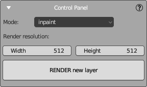
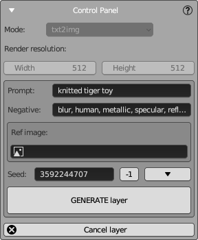
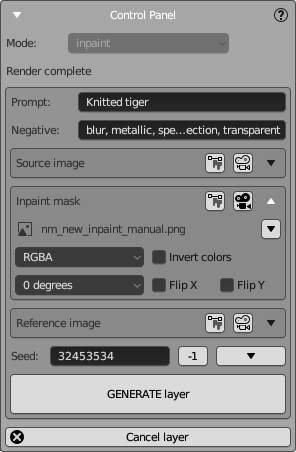

# Control Panel

This is the main panel that controls the creation of a new texture layer.
It contains the primary control buttons and the most important settings.
If you are new to NeuralMaster, use this panel, and as you become more familiar, start using more advanced functions from other panels.

The panel can be in two states, corresponding to different stages of creating a texture layer:
- Render State
- Generation State
- Final State

## Render State

In the Render state, you need to set up the main NeuralMaster camera (default name "nm_camera") properties and some other properties.

### Camera Setup

Leverage the full suite of Blender tools to set up the camera. Even for advanced Blender users, we recommend reading the instructions below and using some NeuralMaster features to control the camera.

- The NeuralMaster main camera is locked to the **main 3D view area** of the NeuralMaster workspace, showing the same view that will be sent to and received from Stable Diffusion. You can unlock it by pressing '0' on the numpad, but we advise against it; use the **additional 3D view area** instead for a third-person view.
- Use the **camera type selector** from the [Camera Control Panel](camera_panel.md) to choose between "Perspective" and "Orthographic" modes.
- **Press and hold the middle mouse button** and move the mouse to rotate the camera around the selected object (by default, it is your textured object).
- **Hold 'Shift' and the middle mouse button** and move the mouse to pan the camera.
- Press the **"." key on the numpad** to set the selected object's origin as the pivot point for the camera.
- **Scroll the mouse wheel** to adjust the camera distance in Perspective mode.
- Adjust the **scale** parameter in the [Camera Control Panel](camera_panel.md) if you're in Orthographic mode.
(Here it would be more convenient to use the mouse wheel as for perspective camera, but, unfortunately, Blender gives a different behavior).
- Use the **additional 3D view area** to move and rotate the camera like any 3D object using the gizmo.
- Set exact camera values (e.g., for aligning the camera along an axis) in the camera properties.

## Settings

Define the texture layer's mode and resolution:
- **Mode**: Choose from `txt2img`, `img2img`, or `inpaint`, depending on the layer you wish to create.
- **Render resolution**: Specify the `Width` and `Height` for the image.

Additional SD settings will be requested in the Generation state (see below). Only the settings listed above are required in the Render state.

After configuring the settings and camera, click **RENDER new layer** to render the diffuse and masks, then proceed to the "Generation" state.

**Note:**
1. Choose the resolution suitable for your SD version. Consult "best practices" on our site and the official Stable Diffusion documentation for more details.
2. Even in `txt2img` mode, rendering is necessary as it creates essential masks (e.g., Normal and Depth masks) for generation.

## SD Connection

If an SD connection hasn't been established, the [SD Connection Panel](sd_connection_panel.md) will appear after rendering. Enter the URL, login, and password to connect to SD, then move to the Generation State.

## Generation State

Once rendering is complete and the SD connection is established, the panel enters the Generation state.

Now, specify the key generation settings and press "Generate layer" to send all source data to SD and receive the result.

Depending on the selected layer mode, the panel will display different settings.

### Text to Image Mode

Generates new images based on text description (and also reference image).
All fields here are common for Stable Diffusion except for the Reference image.

- **Prompt**: Enter descriptive text for AI to generate an image.
- **Negative**: Enter negative prompts to exclude certain elements.
- **Ref image**: Optionally, provide a reference image.
- **Seed**: Set a specific seed for reproducibility or `-1` for randomness.

Click **GENERATE layer** to initiate the generation process.

Click **Cancel layer** to stop the generation and return to the **Render State**.

**Note:**
- **Ref image** is an advanced helper that analyzes your SD configuration to apply the appropriate ControlNet preset based on the selected reference module. For advanced ControlNet configurations, use the [ControlNet configuration panel](sd_controlnet_panel.md).
- To select reference images and adjust properties (e.g., rotation, inversion), use the [Image settings](image_selector.md).
- For advanced SD parameter settings, use the [SD settings panel](sd_settings_panel.md).

You cannot change the layer mode after rendering. If you wish to change the mode while in the **Generation state**, cancel the current layer and create a new one.

### Image to Image Mode

In `img2img` mode, use a render of your 3D model (or another image) as a starting point for texturing. This mode is useful for creating the first texture layer or regenerating all rendered pixels, not just a part.

This mode includes all `txt2img` settings plus:
- **Source image**: Choose the base image for inpainting. The default is the render.
- **Denoising Strength**: Adjust the degree to which the output matches the source image.

**Note:**
- [Image settings](image_selector.md) ui element is used here to select source and reference images and adjust their properties.
- The rendered image is used as the default **source image**, but other images can be chosen or modified (e.g., rotated, inverted).
- Edit the selected image using Blender's image editor (by pressing "Edit" button in image settings element) or any other external 2D editor (by opening the file of the image in the external editor). This mode is similar to Automatic1111 Web UI's Sketch mode but offers more flexibility and power because uf using more powerful 2D editor.
- For advanced SD parameter settings, use the [SD settings panel](sd_settings_panel.md).

### Inpaint Mode

In Inpaint mode, specify the source image and the areas to be regenerated.
Only the marked area will be regenerated; the rest will be retained from the source image.

To edit the Inpaint mask:
- Click "Edit" in the **inpaint image settings** to open the image in the image editor.
- The brush will be set to white, allowing you to select areas for inpainting against a black background.
- Adjust the brush size using standard Blender tools.
- To overlay the result on the rendered image, set the image as the camera's background using the "Show" button in the **inpaint image settings**.

## Final State

After generating the image from SD, it is automatically applied to the model for preview. Adjust layer properties as described in the [Texture Layers Panel](layers_panel.md) to refine the result.

Choose one of the following actions:  

- Click **ReGENERATE layer** to request a new image from SD and apply it to the model.
All the generation state settings remain available here (except for camera settings that can be changed on Render state only).  
- Click **Apply** to save the layer in the layers list and start a new layer from the Render state.  
- Click **Cancel** to cancel the current layer and return to the Render state.  
