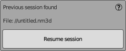

# Open Session

This panel appears if a previous session file is detected.

- Verify that the file path corresponds to your last session before proceeding. The default session file name matches the Blender file name with an "nm3d" extension. A path starting with "//" indicates that the file is located in the same folder as the Blender file.
- Click **Resume session** to pick up where you left off with the existing project.

**Note:**

If the session file has been moved, renamed, or if its custom parameters within NeuralMaster were edited manually, it will not be detected. In this scenario, you will be directed to [the Create New Session window](create_session_panel.md) to initiate a new session.
