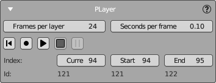

# Player Panel

NeuralMaster includes a bonus feature called "Player" for creating a video about the texturing process.  
The Player plays and records the texturing process by applying each layer step by step from the layers list and smoothly transitions the camera between them.

The Player supports two modes:  
- **Play**: In this mode, the movie will only play on the screen and will not be recorded to disk.  
- **Record**: Plays the movie and records each step as an image in a special folder. By default, the folder's name is "//player," but you can change it in the nm3d file.  

Below is an example of a movie (from 00:37) created using this feature.

  <iframe style="position: absolute; top: 0; left: 0; width: 100%; height: 100%;" 
          src="https://www.youtube.com/embed/b9qeVCmwJ2c" 
          frameborder="0" 
          allow="accelerometer; autoplay; clipboard-write; encrypted-media; gyroscope; picture-in-picture" 
          allowfullscreen>
  </iframe>

**Note**  
The Player's actions are potentially destructive because they delete and restore shot layers.  
**Please back up all data (blend file, nm3d file, and the "images" subfolder) before using the Player**!

## Settings

Two options are available here:    
- **Frames per layer**: Determines the number of frames created for each layer during video recording. The default value is 24.  
- **Seconds per frame**: Indicates the duration each frame is displayed on the screen during playback. If a frame takes longer to render than this value, the playback will not be interrupted; instead, the next frame will start immediately.

## Playback Controls

Use the following playback controls:

- **Rewind Button**: Resets the Player to the **start layer**.
- **Record Button**: Records the texturing process by playing the movie and rendering each frame to the Player's special subfolder.
- **Play Button**: Plays the movie within Blender without rendering.
- **Pause Button**: Halts the playback without rewinding. You can resume playing or recording by pressing Record or Play again.
- **Step Forward Button**: Stops playing and rewinds the Player.

## Sequence Information

Below the playback controls, you'll find information about the current, start, and end layers:

- **Index** row: Displays the current, start, and end indices in the sequence.
- **ID** row: Lists the unique identifiers for the current, start, and end texture layers, corresponding to the indices above.

You can modify the indices for the current, start, and end layers here and view the corresponding IDs.

**Note**   
- By default, the Player will include all completed layers available in the player's list, including active and archived layers.  
- You can exclude a layer from the Player by using the "skip playing" option described in the [Texture Layers Panel](layers_panel.md).
