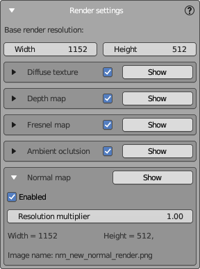
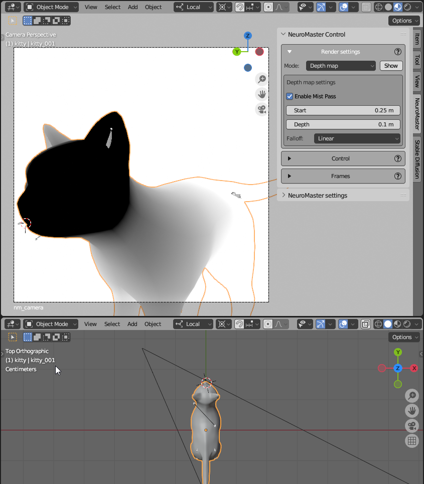
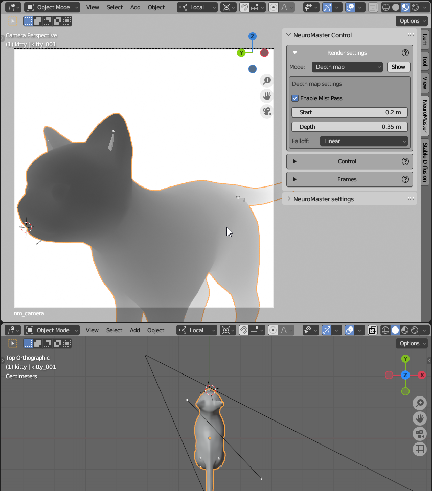

# Renderer Settings Panel

The Renderer Settings panel is designed to configure the rendering parameters for NeuralMaster's texture layers.

Each texture layer comprises a set of maps, necessitating the rendering of various render passes to create them. Here, you can enable or disable these passes and fine-tune the settings for each render map.

**Base Render Resolution**  
Define the basic dimensions for your render output:  
- **Width**: The width of the image to be rendered.  
- **Height**: The height of the image to be rendered.  

These dimensions will determine the canvas size for all generated texture maps. The size for each pass is set by multiplying these parameters by a coefficient specific to that pass, described below.

**Texture Maps**

At the moment NeuralMaster support 7 render passes:

- **Diffuse Texture**: The standard color texture map.  
- **Depth Map**: The classic depth map from Blender.  
- **Normal Map**: The normal map compatible with the Normal Map ControlNet model.  
- **Normals Angle**: 1-channels mask that is an inverted dot between normals and camera view angle. Used to understand the value of stretching the pixels.
- **Inpainting**: Normals Angle mask from peviously created layers. Also used to understand the value of stretching the pixels.
- **Fresnel Map**: The Fresnel map created using Blender's Fresnel shader node. Can be used in some cases as an input for Controlnet.  
- **Ambient Occlusion**: The ambient occlusion map generated using Blender's Ambient Occlusion shader node.  Can be used in some cases as an input for Controlnet.  

**Notes**  
- The diffuse render is used to generate the input image for Stable Diffusion in "inpaint" and "img2img" modes. It is not created in "txt2img" mode.
- 'Normals angle' and 'Inpainting' maps used to understand the value of stretching the pixels bby some features of NeuralMaster.
- 'Depth' and 'Normals angle' maps are also uses for layering the texture layers and it's parameters can be tuned in the layer's editor.    
- Other maps (Depth, Normal, Fresnel, and AO) are used as inputs for ControlNet to ensure consistency between the mesh and texture.  
- The speed of the render phase is dependent on the number of render passes used. Disable any unused render maps to expedite the rendering process.  
- For SD 1.5 model with all available ControlNet models, typically Depth and Normal are used, and AO and Fresnel can be disabled.  
- For SDXL, where the normal map is not available, typically Depth and Fresnel are used, so AO and Normal can be disabled. 

Toggle the visibility and generation of various texture maps associated with your 3D object:

## Collapsed Render Settings

The settings for each render pass can be collapsed or expanded. In the collapsed state, the following options are available for every render pass:
 
- **Expand**: Click the "Triangle" icon to expand the settings of the pass.  
- **Enable/Disable**: A checkbox to toggle the pass on or off.  
- **Show**: A button that applies the appropriate shader and render mode in the main 3D view so you can preview the outcome. This button is solely for preview purposes and does not affect NeuralMaster's operation.

## Expanded Render Settings 

Expanding a pass reveals additional options. Common parameters for each render pass include:

- **Title Row**: Similar to the collapsed mode, use the "Triangle" button to collapse the settings.
- **Enable/Disable Checkbox**: The same as in the collapsed state.
- **Resolution Multiplier**: Scales the pass's resolution relative to the base render resolution. A value of `1.00` retains the base dimensions.
- **Width & Height**: The final resolution for the pass, calculated from the base resolution and the multiplier.
- **Image Name**: Displays the filename for the resulting texture map. This is for reference only and can be edited.

All render passes share these properties except for the depth map, which has additional settings.

## Depth Map Settings

Additional settings for the depth map include:
- **Use auto range**: Automatically determines the depth map's range using the bounding box of the textured 3D model. Disable for manual depth configuration.
- **Enable mist pass**: Activates the mist feature to ensure depth map creation. Disable it, and you'll see an error: "Mist pass is disabled. Enable it to create depth maps."
- **Start**: Sets the near distance where depth begins. Ensure this is closer than the nearest point of the mesh.
- **Depth**: Defines the distance for maximum depth. This should exceed the furthest point of your object from the camera.
- **Falloff**: Determines the transition of the depth map. Linear falloff is recommended, but you may experiment with other types once more experienced.

We recommend you to use **auto range** - it is usually enough to create depth map of enough quality for Stable Diffusion.
But sometimes it's important to set up depth parameters manually using Mist.

## Setting Mist Parameters

Blender provides a user-friendly method for adjusting Mist settings, which NeuralMaster utilizes:
- **Start** and **Depth** parameters appear as points on the camera's central ray and can be adjusted directly within the 3D view.

### Incorrect Mist Settings Example

What's wrong:
- **Start distance** is too far, causing a uniform depth at the foreground.
- **Depth distance** is too short, flattening the background.

### Correct Mist Settings Example

- **Start distance** is just short of the mesh's nearest point.
- **Depth distance** extends just beyond the mesh's furthest point.

This setup provides Stable Diffusion with accurate geometry data to generate the most precise texture.

**Notes**

1. NeuralMaster automatically visualizes the Mist settings on the camera's ray when initializing a session, but you can manually disable it in the camera's properties if necessary.
