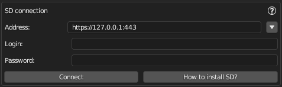
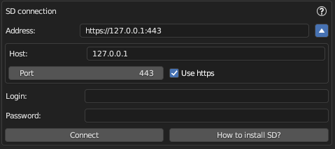

# SD Connection Panel

The SD Connection panel is configured to connect to the Automatic1111 Web UI for Stable Diffusion.

## Connection Settings

To establish a connection with an SD service, please provide the following details:

- **Address**: Enter the full URL of the SD service you wish to connect to.  
The service can be hosted on any internet address, not just localhost. For example, `https://fot3z9z5.vfdv.net/`.
To fill it open your Automatic1111 site in a web browser, copy the entire URL to your clipboard and paste it here.  
- **Login**: Input the username or login ID as provided by the SD service.  
- **Password**: Enter the password associated with the service.

Click the **Connect** button to establish a connection to Stable Diffusion.  
Upon successful connection, a message such as "Connection established" will appear.  
If the connection has been established, the **Connect** button will change to **Reconnect**. You can click this to test the connection or to reconnect if any settings have been modified.

## Additional URL Settings

For more detailed control, press the "triangle" icon next to the address line to access additional settings:

- **Host**: allow you to enter just the host address.
- **Port**: If your service doesn't use the standard HTTPS port (443), specify the port number here.
- **Use HTTPS**: Tick this option if your service requires a secure HTTPS connection, which corresponds to an HTTPS prefix in the URL.
