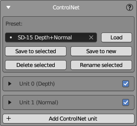
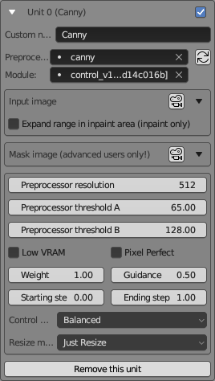

# SD ControlNet Panel

This panel is designed for configuring ControlNet - an advanced add-on for Stable Diffusion that provides enhanced control over image generation.  
Thanks to ControlNet technology, it is possible to generate textures that precisely fit 3D models, that is achieved using two ControlNet models: a depth mask and a normal mask.  
Furthermore, ControlNet significantly contributes to the maintenance of consistency across the entire surface of a texture by utilizing the IP adapter and reference model.

## ControlNet Panel View

When generating textures, you may use several ControlNet units; typically, 2 to 5 units are used when working with NeuralMaster.  
The ControlNet panel enables you to add and configure ControlNet units, save settings as presets, and manage these presets.

### Preset Management

- **Preset**: Displays the currently selected preset in the dropdown menu.  
- **Load**: Loads the selected preset.
- **Save to selected**: Saves the current settings to the selected preset.
- **Save to new**: Saves the current settings as a new preset. Upon clicking this button, a window will prompt you to enter a name for the new preset.
- **Delete selected**: Removes the selected preset from the list.
- **Rename selected**: Changes the name of the selected preset. Clicking this button opens a window where you can enter a new name for the preset.

### ControlNet Units

Below the presets is a list of ControlNet units. Here you can create, delete, and adjust them.

Each unit's settings can be collapsed or expanded.  
In collapsed mode, you can see the unit's name and enable or disable it using the checkbox on the right.
The image above shows two configured ControlNet units, **Depth** and **Normal**, both in collapsed mode.  
**Add ControlNet Unit**: Creates a new ControlNet unit.

## Expanded ControlNet Unit View

The expanded view of a ControlNet unit provides a comprehensive set of options that allow you to fine-tune how the AI interprets and manipulates the input data.  
Standard parameters of the Automatic1111 web UI are used, preserving their original names.  
Please refer to the original Automatic1111 documentation for more detailed information.

### Custom Module Settings

- **Custom name**: A custom string typed by the user, displayed in the title of the Unit. In the example, it's named "Canny".
- **Preprocessor**: Choose a preprocessor type from the dropdown, which in this case is set to "canny".
- **Module**: Select the module version for the unit. The example shows the `Canny` model.

If the ControlNet Unit uses masks generated by NeuralMaster (for example, a Depth map or Normal map), do not choose a preprocessor!  
However, in some cases, you must use a preprocessor to generate a control mask from your diffuse texture or any other source mask.  
For example, you can create a Canny mask from a Fresnel mask (generated by NeuralMaster) using the 'canny' preprocessor - this is one of the available methods to maintain consistency between the mesh and texture. 

### Image Settings

To select images and set some of their properties (for example, rotation or color inversion), the universal UI element [Image settings](image_selector.md) is used.

**Input image**  
This ui element allows you to select the input image for this particular unit.

**Expand range in inpaint area (inpaint only)**  
An option to broaden the area affected by inpainting, applicable only in inpaint mode.

**Mask image (advanced users only!)**  
The ControlNet unit receives two images as input - the input image and the mask image - but usually, only the first is used. 
- If the preprocessor is enabled, then the input image goes to the preprocessor, and the preprocessor's output goes to the ControlNet model's input.
- If the preprocessor is disabled, then the input image goes directly to the ControlNet model's input.

In some advanced cases, you can set both the input image and mask image, and in this case, you understand it better than the author of this instruction.
Please do not set the mask image if you do not understand how it works.

A dropdown to select a mask image that the unit will use to define areas of interest or exclusion.

### Preprocessing Parameters

- **Preprocessor resolution**: Defines the resolution at which the preprocessor operates.
- **Preprocessor threshold A**: The first threshold parameter for the preprocessor algorithm.
- **Preprocessor threshold B**: The second threshold parameter for the preprocessor algorithm.

The values of **Preprocessor threshold A** and **Preprocessor threshold B** depend on the type of preprocessor and can be very different.
For some preprocessors, values from 0 to 1 are possible, but for others, they range from 0 to 255.

### Weighting and Guidance

- **Weight**: Sets the influence weight of this unit on the final image.
- **Guidance**: Adjusts the guidance strength, which affects how strictly the generated image follows the input parameters.
- **Starting step**: Determines the step at which this unit begins influencing the generation.
- **Ending step**: Sets the step at which this unit ceases influencing the generation.

### Control mode

**Control mode** dropdown options:  
- **Balanced**: Balances your written prompt with ControlNet. Similar to the previous version's non-activated Guess Mode.  
- **My prompt is more important**: Focuses more on your prompt, reducing ControlNet's influence. Your prompt details will be more prominent in the image.  
- **ControlNet is more important**: Increases ControlNet's influence based on your CFG Scale. For example, at a CFG Scale of 7, ControlNet is 7 times stronger, allowing it to interpret and add details not specified in your prompt.  

### Other Options

- **Low VRAM**: Allows ControlNet to function with less than 6GB of VRAM, at the expense of processing speed.
- **Pixel Perfect**: When checked, automatically calculates the correct Preprocessor resolution for the input image (more details below!)
- **Resize mode**: Defines how images are resized, with "Just Resize" being one of the options.

### Remove this unit

This button allows you to delete the current unit from the configuration.  

