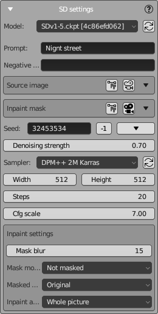

# SD Settings Panel

NeuralMaster uses Stable Diffusion WebUI Automatic1111 to generate images.  
Standard parameters of Automatic1111 are used, and original names are preserved.  
This page provides short information on how to use each SD setting.  
Please refer to the Automatic1111 documentation for detailed information.

## Model Selection

**Model**  
Select the desired version of the Stable Diffusion model from the dropdown. The model file, such as `SDv1.5.ckpt`, represents a saved state of the model that can be loaded and used for image generation.

## Prompt Settings

**Prompt**  
Enter a text description in this field. The AI uses this description as guidance to generate the corresponding image. For instance, entering "Night street" will instruct the AI to create an image depicting a street scene during nighttime.

**Negative Prompt**  
Negative prompting is specifying what you don't want in your image.
It's usually not a bad idea to add the following here: "blur, metallic, specular, transparent, reflection". 

## Image and Mask Settings

To select images and set some of their properties (for example, rotation or color inversion), the universal UI element [Image settings](image_selector.md) is used.

**Source Image**  
This item is available only in the "img2img" and "inpaint" modes.  
Upload an image here if you want to use it as a reference or starting point for the AI during image generation.

**Inpaint Mask**  
This item is only available in the "inpaint" mode.  
Define areas in the source image that the AI should modify or fill in.

## Seed Settings

**Seed**  
Controls the randomness of the image generation.  
Entering a specific number will allow you to reproduce the same results given the same settings.  
A value of '-1' means a random seed will be used each time.  
Use the "-1" button to set the seed to "-1".  
Use the button with the "triangle" icon on the right to select one of the seeds used in the past.

## Generation Settings

**Denoising Strength**  
This item is available only in the "img2img" and "inpaint" modes.  
Using this setting, adjust the degree to which the generated output matches the input image specified by the parameter "Input image".

**Sampler**  
Choose the algorithm for sampling during the image generation process.  
Multiple sampler algorithms exist, and your SD host can support many of them.  
`DPM++ 2M Karras` is one of the more popular and optimal by speed and quality, and we recommend it for starters.

**Width/Height**  
Set the dimensions of the output image in pixels.  
By default, the same dimensions that were used for rendering are used, and you don't need to change them.  
But if you are an advanced user and understand well how SD works, you can adjust it here.

**Steps**  
The number of refinement iterations the model will perform.  
More steps can lead to a more detailed and polished image, but on the other hand, the more steps, the longer the AI takes to create the image.  
Therefore, you need to choose a compromise value.  
When you use the `DPM++ 2M Karras` sampler, a value of 10-20 is often enough.  
But if you use multiple controlnet units, it's recommended to increment "Steps" by +5...10 for every controlnet unit.

**Cfg scale**  
The most mysterious SD parameter.  
On the Internet, you can find many attempts to explain in simple terms how this parameter works, but it seems that they all failed.  
Even the range of possible parameter values - from 1 to 25 - looks strange in itself.  
In a practical sense, it is important that this parameter somehow affects the style of the image.  
Values around 7 (for some reason) create an image that is close to photorealism, while small values close to 1 or large values close to 21 tend toward abstraction.  
Beginners are advised not to touch it.

## Inpaint Settings

The following settings are only available in the "inpaint" mode.

**Mask Blur**  
Control the sharpness of the inpaint mask's edges. Higher values create a softer transition between the inpainted area and the rest of the image.  
When working with NeuralMaster, you usually do not need to change the value of this parameter,  
because the Blender expression editor is already used to create the mask, and the brush you use already creates a smoothed mask.

You can blur the inpainting mask manually if you use smoothed brush for painting teh mask or use 'Smoot' from [Inpainting tools](inpaint_tools_panel.md). In this case you can set this option to 0.

**Mask mode**  
This setting dictates how the mask is applied to the image. Two items are available here: "Masked" and "Not Masked".  
By default, "Not Masked" is used, which can look strange.  
The reason is that NeuralMaster uses white color to show the masked area (it is more convenient for painting), but SD uses black.  
If you want to use the "Masked" SD mode here, you can do it, but you also need to invert the inpaint mask colors using the checkbox "invert" in the inpaint image settings.

**(NEW) Masked area**  

Shows the area that will be used for control of generation in inpaint mode.  
There are 4 available values:

- **Original** - uses the image "under" the inpaint mask as a control image for generation.  
- **Fill** - uses an image generated from all the pixels excluding masked areas as a control image for generation.  
- **Noise** - uses a random image as a control image for generation.  
- **Nothing** - uses an empty image as a control image for generation.
- **(NEW) Neural Master** - is and innovative mode that is allowed here if the extension ["Neural Master Inpainter"](../nm_inpainter/README.md) is installed to the host of Automatic 1111

We recommend you to use **Neural Master** mode if the texture inside the inpainting area is significantly incorrect (for example, contains absolutely wrong colors).

**Original** mode can be used if the image "under" the inpaint mask is pretty good, but you want to improve it (using your prompt and ControlNet masks).

**Noise** and **Nothing** usually can't be applicable for texturing because they significantly modify the image and don't maintain the consistency of the texture. 
But if you use a very strong prompt or a strong reference image or Lora to keep the consistency, then "Noise" or "Nothing" sometimes can help you to generate some interesting details on your texture.

**Inpaint area**  

Determines which area of the image will be analyzed during inpainting.  
There are two options here: 'Whole picture' and 'Only masked'.  
Since the goal when texturing is to preserve the consistency of the image, when inpainting it is necessary to analyze the image as a whole.  
Therefore, in the vast majority of cases, it is recommended to use 'Whole picture'.

Please refer to the Automatic1111 documentation for detailed information.
